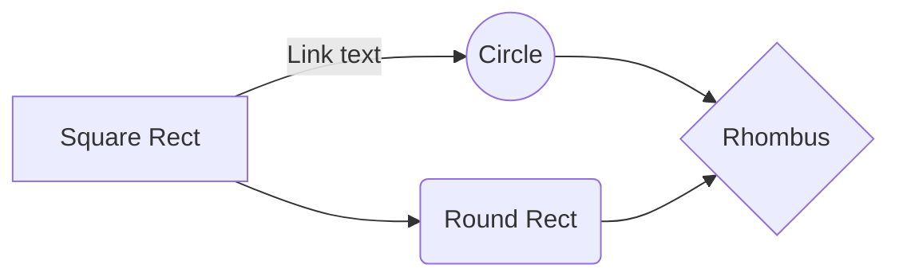

# Welcome to my portfolio

Hello, a brief summary about me, im **Brazilian**, born and raised in **São Paulo**, in love with my family and a dedicated student in Data Science, I am currently studying my **Master in Statistics and Data Science at MIT**, MIT is one of the biggest and best institutes of technology in the world, and I am very proud to be able to be part of this environment that exudes knowledge and cutting edge technology.

I am graduated in **computer engineering** and passionate about any and all data solutions, currently working with studies and analysis to generate insights and solutions for the business area.

My main projects are based on deep leanring, I use the most diverse technologies of machine learning to build my software and models.

**Technical proficiencies include:**

**Database:** 

 - [x] SQL Server, Oracle, PostgreSQL,
 - [x] Spark, SSIS, SAS, Data modeling

**Data and Computer  science:** 

 - [x] Python, SQL, A little bit "R"
 - [x] APIs REST
 - [x] Elasticsearch, MongoDB
 - [x] Data Visualization and Evaluating
 - [x] Machine and Deep Learnig Libs
	 - [x] keras, tensorflow, pytorch, Scikit-learning
	 - [x] NLPK, LSTM, RNN, GRU
	 - [x] A little bit about XGBoost and PyBrain

**Statistics:** 
 - [x] Prediction, classification, descriptive, uncertainty, sampling, probability
 - [x] Time series forecasting, Logistic Regression, ARIMA and others

 **LinkedIn:** [brunoluizmendes](https://www.linkedin.com/in/brunoluizmendes/)
 **Medium:** [Data Easy](https://brunoluizmendes.medium.com)
 
 
# About Projetcs

xxxxxxxxxxxxxxxxxxxxxxxxxxxxxxxxxxxxxxxxxxxxxxxxxxxxxxxxxxxxxxxxxxxxxxxxxxxxxxxxxxxxxxxxxxxxxxxx

## Fundamental and technical analysis of stock market
## Time Series of Price Anomaly Detection with LSTM
## Customer Churn Analysis 
## Sentimental analysis of financial market news
## My portifolio Page

xxxxxxxxxxxxxxxxxxxxxxxxxxxxxxxxxxxxxx
- xxxxxxxxxxxxxxxxxxxxxxxxxx
	> To start syncing your workspace, just sign in with Google in the menu.

## SmartyPants

SmartyPants converts ASCII punctuation characters into "smart" typographic punctuation HTML entities. For example:

|                |ASCII                          |HTML                         |
|----------------|-------------------------------|-----------------------------|
|Single backticks|`'Isn't this fun?'`            |'Isn't this fun?'            |
|Quotes          |`"Isn't this fun?"`            |"Isn't this fun?"            |
|Dashes          |`-- is en-dash, --- is em-dash`|-- is en-dash, --- is em-dash|

## Precision

$$
Precision = TP/TP+FP
$$
$$
Recall = TP/TP+FN
$$

> You can find more information about **Precision and Recall** mathematical expressions [here](https://en.wikipedia.org/wiki/Precision_and_recall).

And this will produce a flow chart:

